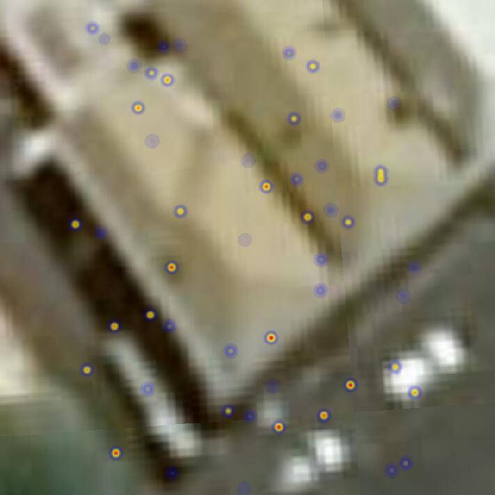

a. 添加类， 代码内容 "define('Scene/HeatmapImageryProvider',["......" return HeatmapImageryProvider;});"整段，添加到define定义之后，Cesium定义之前，cesium里面provider有很多，如果你知道一两个就更好了，HeatmapImageryProvider和他们的角色相似，这里我们可以搜索BingMapsImageryProvider，可以查找它，然后把定义代码放在它之后，这样，应该不会错

b. 添加 './Scene/HeatmapImageryProvider' 到Cesium另一的第一个参数 搜索"define('Cesium',[" 将它加到BingMapsImageryProvider类似配置之后，

c. 添加 Scene_HeatmapImageryProvider 到Cesium第二个参数，同上思路

d. 添加Cesium['HeatmapImageryProvider'] = Scene_HeatmapImageryProvider;到cesium内部,搜索"var Cesium = {"，添加

e. 移除HeatmapImageryProvider.js 文件中的heatmap.js v2.0.0 之前的内容(最后一段压缩过的代码就是heatmap.js的内容)

f.最后为了方便缩放，添加一个点entity到viewer
```
viewer.entities.add({
	point: {
		coordinates: Cesium.Rectangle.fromDegrees(147.1385, -41.435)
	}
});
viewer.zoomTo(viewer.entities);
```

g. 刷新可看到效果

